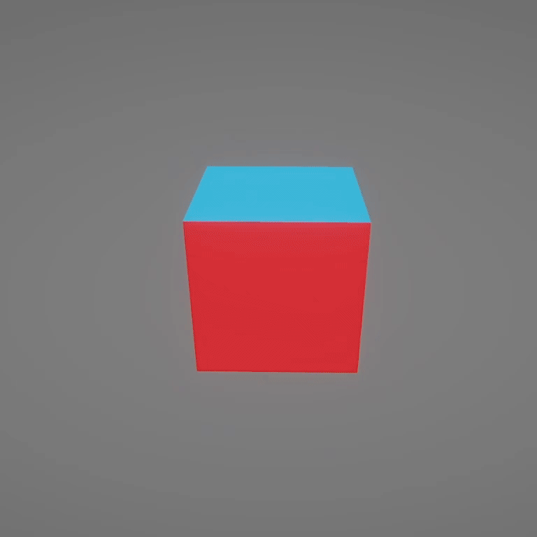

# 6-Sided Cube Shader Graph
- An Unity `Shader Graph` that allows you to assign different Textures for each side of a Cube.
- Should work for both **Legacy** and **URP** 
- Currently set to `Lit`, you can edit the settings to change to `Unlit`

